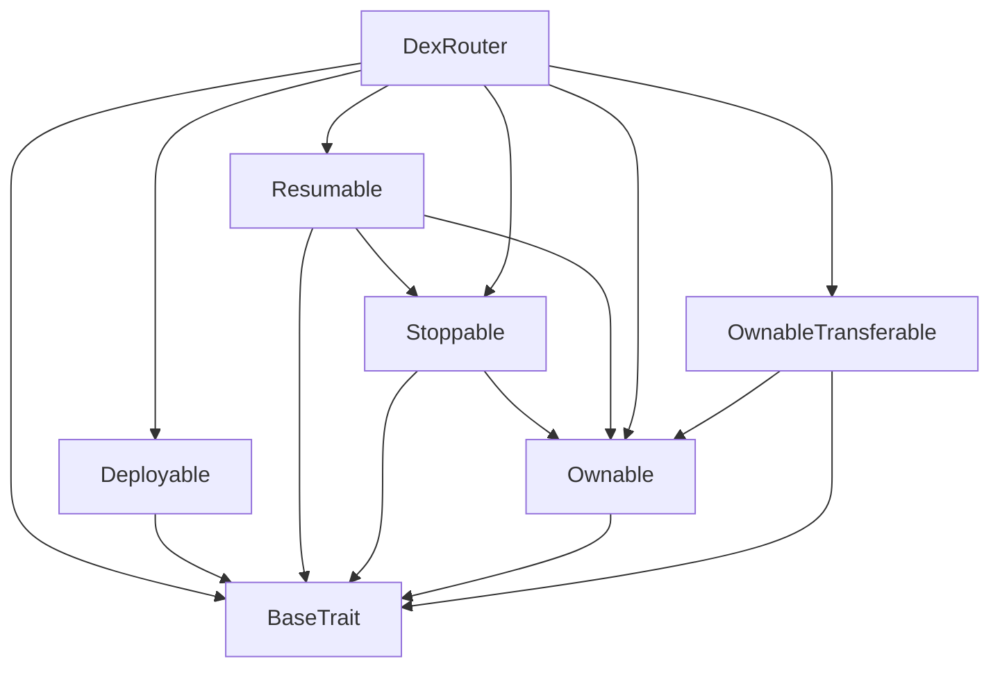
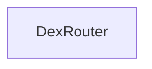

# TACT Compilation Report
Contract: DexRouter
BOC Size: 4469 bytes

# Types
Total Types: 41

## StateInit
TLB: `_ code:^cell data:^cell = StateInit`
Signature: `StateInit{code:^cell,data:^cell}`

## Context
TLB: `_ bounced:bool sender:address value:int257 raw:^slice = Context`
Signature: `Context{bounced:bool,sender:address,value:int257,raw:^slice}`

## SendParameters
TLB: `_ bounce:bool to:address value:int257 mode:int257 body:Maybe ^cell code:Maybe ^cell data:Maybe ^cell = SendParameters`
Signature: `SendParameters{bounce:bool,to:address,value:int257,mode:int257,body:Maybe ^cell,code:Maybe ^cell,data:Maybe ^cell}`

## ChangeOwner
TLB: `change_owner#819dbe99 queryId:uint64 newOwner:address = ChangeOwner`
Signature: `ChangeOwner{queryId:uint64,newOwner:address}`

## ChangeOwnerOk
TLB: `change_owner_ok#327b2b4a queryId:uint64 newOwner:address = ChangeOwnerOk`
Signature: `ChangeOwnerOk{queryId:uint64,newOwner:address}`

## Deploy
TLB: `deploy#946a98b6 queryId:uint64 = Deploy`
Signature: `Deploy{queryId:uint64}`

## DeployOk
TLB: `deploy_ok#aff90f57 queryId:uint64 = DeployOk`
Signature: `DeployOk{queryId:uint64}`

## FactoryDeploy
TLB: `factory_deploy#6d0ff13b queryId:uint64 cashback:address = FactoryDeploy`
Signature: `FactoryDeploy{queryId:uint64,cashback:address}`

## JettonData
TLB: `_ total_supply:int257 mintable:bool owner:address content:^cell wallet_code:^cell = JettonData`
Signature: `JettonData{total_supply:int257,mintable:bool,owner:address,content:^cell,wallet_code:^cell}`

## JettonWalletData
TLB: `_ balance:int257 owner:address master:address code:^cell = JettonWalletData`
Signature: `JettonWalletData{balance:int257,owner:address,master:address,code:^cell}`

## JettonTransferForwardPayload
TLB: `_ is_right:bool value:remainder<slice> = JettonTransferForwardPayload`
Signature: `JettonTransferForwardPayload{is_right:bool,value:remainder<slice>}`

## TokenTransfer
TLB: `token_transfer#0f8a7ea5 query_id:uint64 amount:coins destination:address response_destination:Maybe address custom_payload:Maybe ^cell forward_ton_amount:coins forward_payload:remainder<slice> = TokenTransfer`
Signature: `TokenTransfer{query_id:uint64,amount:coins,destination:address,response_destination:Maybe address,custom_payload:Maybe ^cell,forward_ton_amount:coins,forward_payload:remainder<slice>}`

## JettonTransfer
TLB: `jetton_transfer#0f8a7ea5 query_id:uint64 amount:coins destination:address response_destination:Maybe address custom_payload:Maybe ^cell forward_ton_amount:coins forward_payload:JettonTransferForwardPayload{is_right:bool,value:remainder<slice>} = JettonTransfer`
Signature: `JettonTransfer{query_id:uint64,amount:coins,destination:address,response_destination:Maybe address,custom_payload:Maybe ^cell,forward_ton_amount:coins,forward_payload:JettonTransferForwardPayload{is_right:bool,value:remainder<slice>}}`

## TokenTransferInternal
TLB: `token_transfer_internal#178d4519 query_id:uint64 amount:coins from:address response_destination:Maybe address forward_ton_amount:coins forward_payload:remainder<slice> = TokenTransferInternal`
Signature: `TokenTransferInternal{query_id:uint64,amount:coins,from:address,response_destination:Maybe address,forward_ton_amount:coins,forward_payload:remainder<slice>}`

## TokenNotification
TLB: `token_notification#7362d09c query_id:uint64 amount:coins from:address forward_payload:remainder<slice> = TokenNotification`
Signature: `TokenNotification{query_id:uint64,amount:coins,from:address,forward_payload:remainder<slice>}`

## TokenBurn
TLB: `token_burn#595f07bc query_id:uint64 amount:coins response_destination:Maybe address custom_payload:Maybe ^cell = TokenBurn`
Signature: `TokenBurn{query_id:uint64,amount:coins,response_destination:Maybe address,custom_payload:Maybe ^cell}`

## TokenBurnNotification
TLB: `token_burn_notification#7bdd97de query_id:uint64 amount:coins sender:address response_destination:Maybe address = TokenBurnNotification`
Signature: `TokenBurnNotification{query_id:uint64,amount:coins,sender:address,response_destination:Maybe address}`

## TokenExcesses
TLB: `token_excesses#d53276db query_id:uint64 = TokenExcesses`
Signature: `TokenExcesses{query_id:uint64}`

## TokenUpdateContent
TLB: `token_update_content#af1ca26a content:^cell = TokenUpdateContent`
Signature: `TokenUpdateContent{content:^cell}`

## ProvideWalletAddress
TLB: `provide_wallet_address#2c76b973 query_id:uint64 owner_address:address include_address:bool = ProvideWalletAddress`
Signature: `ProvideWalletAddress{query_id:uint64,owner_address:address,include_address:bool}`

## TakeWalletAddress
TLB: `take_wallet_address#d1735400 query_id:uint64 wallet_address:address owner_address:remainder<slice> = TakeWalletAddress`
Signature: `TakeWalletAddress{query_id:uint64,wallet_address:address,owner_address:remainder<slice>}`

## SwapInfo
TLB: `_ tokenA:address amount:int257 = SwapInfo`
Signature: `SwapInfo{tokenA:address,amount:int257}`

## SwapJettonInStonfi
TLB: `_ op:uint32 transfer_jetton_fee:uint32 tokenB:address minReturn:coins recipient_addr:address referral_addr:Maybe address additional_info:Maybe ^slice invalidQuery:remainder<slice> = SwapJettonInStonfi`
Signature: `SwapJettonInStonfi{op:uint32,transfer_jetton_fee:uint32,tokenB:address,minReturn:coins,recipient_addr:address,referral_addr:Maybe address,additional_info:Maybe ^slice,invalidQuery:remainder<slice>}`

## DedustSuccessInfo
TLB: `_ op:uint32 query_id:uint64 user:address = DedustSuccessInfo`
Signature: `DedustSuccessInfo{op:uint32,query_id:uint64,user:address}`

## DedustFailInfo
TLB: `_ op:uint32 query_id:uint64 user:address tokenA:address = DedustFailInfo`
Signature: `DedustFailInfo{op:uint32,query_id:uint64,user:address,tokenA:address}`

## DedustJettonSwapInfo
TLB: `_ op:uint32 pool:address kind:bool minReturn:coins next:Maybe ^cell swapParams:^cell = DedustJettonSwapInfo`
Signature: `DedustJettonSwapInfo{op:uint32,pool:address,kind:bool,minReturn:coins,next:Maybe ^cell,swapParams:^cell}`

## DedustNativeSwapInfo
TLB: `_ op:uint32 query_id:uint64 amount:coins pool:address kind:bool minReturn:coins next:Maybe ^cell swapParams:^cell = DedustNativeSwapInfo`
Signature: `DedustNativeSwapInfo{op:uint32,query_id:uint64,amount:coins,pool:address,kind:bool,minReturn:coins,next:Maybe ^cell,swapParams:^cell}`

## DedustSwapParams
TLB: `_ deadline:uint32 recipient_addr:Maybe address referral_addr:Maybe address fufill_payload:Maybe ^cell reject_payload:Maybe ^cell = DedustSwapParams`
Signature: `DedustSwapParams{deadline:uint32,recipient_addr:Maybe address,referral_addr:Maybe address,fufill_payload:Maybe ^cell,reject_payload:Maybe ^cell}`

## SwapJettonInDedust
TLB: `_ op:uint32 transfer_jetton_fee:uint32 vaultA:address pool:address minReturn:coins recipient_addr:Maybe address referral_addr:Maybe address next:Maybe ^cell additional_info:Maybe ^slice invalidQuery:remainder<slice> = SwapJettonInDedust`
Signature: `SwapJettonInDedust{op:uint32,transfer_jetton_fee:uint32,vaultA:address,pool:address,minReturn:coins,recipient_addr:Maybe address,referral_addr:Maybe address,next:Maybe ^cell,additional_info:Maybe ^slice,invalidQuery:remainder<slice>}`

## DedustPayOut
TLB: `dedust_pay_out#474f86cf query_id:uint64 payload:Maybe ^slice = DedustPayOut`
Signature: `DedustPayOut{query_id:uint64,payload:Maybe ^slice}`

## SwapNativeInDedust
TLB: `swap_native_in_dedust#b52ed25f query_id:uint64 amount:coins pool:address minReturn:coins recipient_addr:Maybe address referral_addr:Maybe address next:Maybe ^cell additional_info:Maybe ^slice invalidQuery:remainder<slice> = SwapNativeInDedust`
Signature: `SwapNativeInDedust{query_id:uint64,amount:coins,pool:address,minReturn:coins,recipient_addr:Maybe address,referral_addr:Maybe address,next:Maybe ^cell,additional_info:Maybe ^slice,invalidQuery:remainder<slice>}`

## ValidInfo
TLB: `_ isValid:bool op:uint32 payload:^slice transfer_jetton_fee:uint32 = ValidInfo`
Signature: `ValidInfo{isValid:bool,op:uint32,payload:^slice,transfer_jetton_fee:uint32}`

## JettonPayload
TLB: `_ isStonFi:bool payload:^slice = JettonPayload`
Signature: `JettonPayload{isStonFi:bool,payload:^slice}`

## AdditionalInfo
TLB: `_ additional_info:Maybe ^slice = AdditionalInfo`
Signature: `AdditionalInfo{additional_info:Maybe ^slice}`

## SwapNativeInStonfi
TLB: `swap_native_in_stonfi#04996458 query_id:uint64 amount:coins tokenB:address minReturn:coins recipient_addr:address referral_addr:Maybe address additional_info:Maybe ^slice invalidQuery:remainder<slice> = SwapNativeInStonfi`
Signature: `SwapNativeInStonfi{query_id:uint64,amount:coins,tokenB:address,minReturn:coins,recipient_addr:address,referral_addr:Maybe address,additional_info:Maybe ^slice,invalidQuery:remainder<slice>}`

## WithdrawInfo
TLB: `withdraw_info#b75b96d7 token:Maybe address amount:Maybe coins to:Maybe address value:Maybe coins isNative:bool = WithdrawInfo`
Signature: `WithdrawInfo{token:Maybe address,amount:Maybe coins,to:Maybe address,value:Maybe coins,isNative:bool}`

## ChangeFwdFee
TLB: `change_fwd_fee#670db556 stonfi_fwd:uint64 = ChangeFwdFee`
Signature: `ChangeFwdFee{stonfi_fwd:uint64}`

## ChangeProcessFee
TLB: `change_process_fee#80e1f11b process_fee:uint64 = ChangeProcessFee`
Signature: `ChangeProcessFee{process_fee:uint64}`

## ChangeMinimumFee
TLB: `change_minimum_fee#53e70ead minimum_fee:uint64 = ChangeMinimumFee`
Signature: `ChangeMinimumFee{minimum_fee:uint64}`

## DeleteRecord
TLB: `delete_record#6616571a query_id:uint64 = DeleteRecord`
Signature: `DeleteRecord{query_id:uint64}`

## ChangePub
TLB: `change_pub#1b1d9711 signer_pub:uint256 = ChangePub`
Signature: `ChangePub{signer_pub:uint256}`

# Get Methods
Total Get Methods: 8

## getStonfiFwdAmount

## getSeq

## getProcessFee

## getMiniumFee

## getUserStonfiProxyAddr
Argument: user

## getUserDedustProxyAddr
Argument: user

## stopped

## owner

# Error Codes
2: Stack underflow
3: Stack overflow
4: Integer overflow
5: Integer out of expected range
6: Invalid opcode
7: Type check error
8: Cell overflow
9: Cell underflow
10: Dictionary error
13: Out of gas error
32: Method ID not found
34: Action is invalid or not supported
37: Not enough TON
38: Not enough extra-currencies
128: Null reference exception
129: Invalid serialization prefix
130: Invalid incoming message
131: Constraints error
132: Access denied
133: Contract stopped
134: Invalid argument
135: Code of a contract was not found
136: Invalid address
137: Masterchain support is not enabled for this contract
26695: msg.value too low
40368: Contract stopped
44535: amount = 0
53296: Contract not stopped
54159: should not reach here

# Trait Inheritance Diagram

# Contract Dependency Diagram

